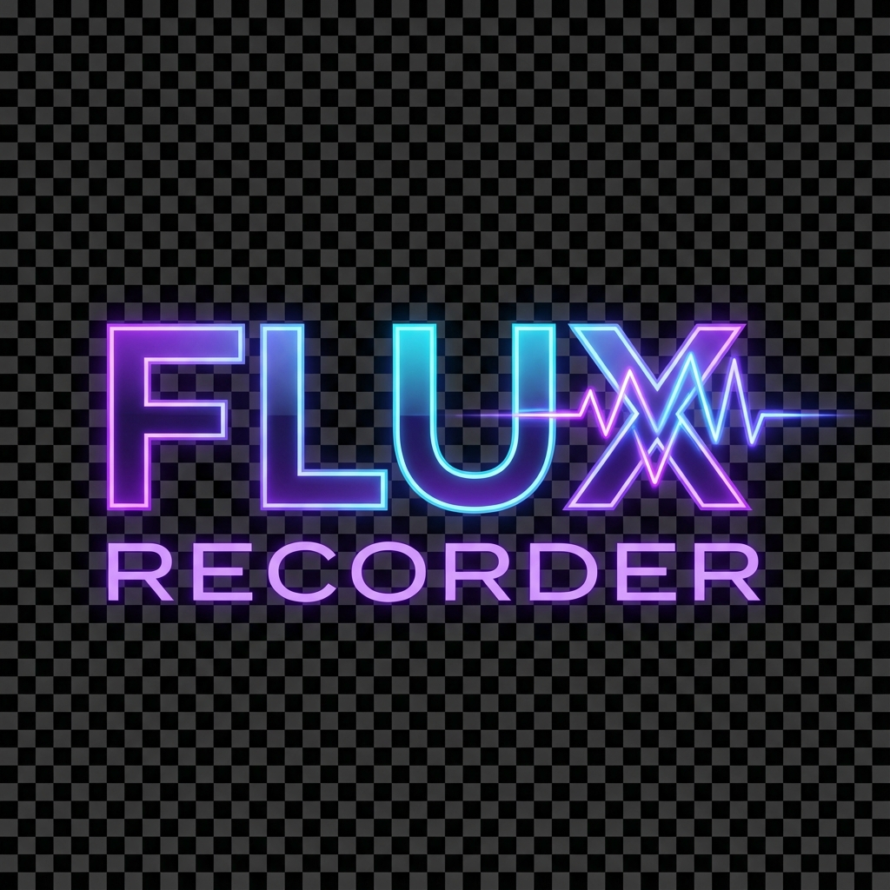

# Flux Recorder

  
  
  ### Professional Screen Recording for Android
  
  
  
  
  

## 📱 About

Flux Recorder is a powerful, feature-rich screen recording application for Android that lets you capture your device's screen with exceptional quality and flexibility. Perfect for creating tutorials, recording gameplay, capturing video calls, or saving important moments.

## ✨ Features

- **High-Quality Recording**
  - Multiple resolution options: 1080p, 720p, 480p
  - Customizable bitrate for optimal quality
  - Variable Bitrate (VBR) encoding for efficient file sizes

- **Flexible Audio Capture**
  - Internal audio (system sounds) - Android 10+
  - Microphone input
  - Both simultaneously
  - Silent recording option

- **User-Friendly Interface**
  - Clean, modern Material Design 3 UI
  - Intuitive recording controls
  - Floating overlay for easy access
  - Real-time recording status

- **Advanced Features**
  - Optional facecam overlay
  - Automatic file management
  - Built-in recordings library
  - Orientation-aware recording
  - No watermarks
  - Completely free

- **Privacy-Focused**
  - No data collection
  - No analytics or tracking
  - All recordings stored locally
  - Full user control

## 🚀 Download

## 📸 Screenshots

  
  
  
  

## 🛠️ Technical Details

- **Built with:** Kotlin, Jetpack Compose
- **Architecture:** MVVM with Clean Architecture
- **Dependency Injection:** Hilt
- **Media:** MediaCodec, MediaMuxer, MediaProjection
- **Min SDK:** 24 (Android 7.0)
- **Target SDK:** 35 (Android 15)

## 📋 Permissions

- **Camera:** For optional facecam feature during recording
- **Record Audio:** To capture system audio and/or microphone input
- **Storage Access:** To save recordings to device storage
- **Foreground Service:** To maintain recording in background
- **Post Notifications:** To display recording status

## 🔒 Privacy

We take your privacy seriously. Flux Recorder:
- Does not collect any personal data
- Does not use analytics or tracking
- Does not share data with third parties
- Stores all recordings locally on your device

Read our full [Privacy Policy](PRIVACY_POLICY.md)

## 📝 License

This project is licensed under the MIT License - see the [LICENSE](LICENSE) file for details.

## 🤝 Contributing

Contributions are welcome! Please feel free to submit a Pull Request.

## 📧 Contact

- **Email:** icradleinnovations@gmail.com
- **Website:** [icradleinnovations.com](https://icradle.io)
- **Issues:** [GitHub Issues](https://github.com/Icradle-Innovations-Ltd/FluxRecorder/issues)

## 🙏 Acknowledgments

Built with ❤️ by Icradle Innovations Ltd

---

  Made with Kotlin and Jetpack Compose

